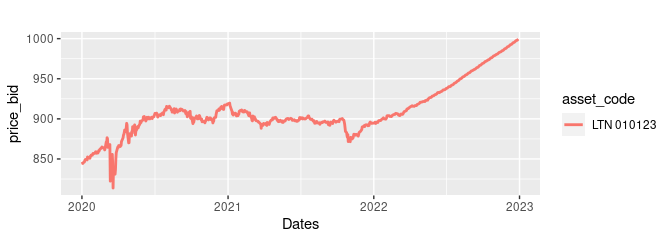

<!-- README.md is generated from README.Rmd. Please edit that file -->
<!-- badges: start -->

[](https://app.codecov.io/gh/msperlin/GetTDData?branch=master)
[](https://www.repostatus.org/#active)
[](https://github.com/msperlin/GetTDData/actions)

<!-- badges: end -->

# Package `GetTDData`

Information regarding prices and yields of bonds issued by the Brazilian
government can be downloaded manually as excel files from the [Tesouro
Direto website](https://www.tesourodireto.com.br/). However, it is
painful to aggregate all of this data into something useful as the
several files don’t have an uniform format.

Package `GetTDData` makes the process of importing data from Tesouro
direto much easier. All that you need in order to download the data is
the name of the assets (LFT, LTN, NTN-C, NTN-B, NTN-B Principal, NTN-F).

## Installation

    # from CRAN (stable version)
    install.package('GetTDData')

    # from github (development version)
    devtools::install_github('msperlin/GetTDData')

## How to use GetTDData

Suppose you need financial data (prices and yields) for a bond of type
LTN with a maturity (end of contract) at 2023-01-01. This bullet bond is
the most basic debt contract the Brazilian government issues. It does
not pay any value (coupon) during its lifetime and will pay 1000 R\$ at
maturity.

In order to get the data, all you need to do is to run the following
code in R:

``` r
library(GetTDData)

assets <- 'LTN'   # Identifier of assets 
first_year <- 2020
last_year <- 2022

df_td <- td_get(assets,
                first_year,
                last_year)
#> 
#> ── Downloading TD files
#> ℹ Downloading LTN_2020.xls
#> ✔    '/tmp/Rtmpf9eiRh/td-files/LTN/LTN_2020.xls' is found, with size 176.1 kB.
#> ℹ Downloading LTN_2021.xls
#> ✔    '/tmp/Rtmpf9eiRh/td-files/LTN/LTN_2021.xls' is found, with size 175.1 kB.
#> ℹ Downloading LTN_2022.xls
#> ✔    '/tmp/Rtmpf9eiRh/td-files/LTN/LTN_2022.xls' is found, with size 175.6 kB.
#> 
#> ── Checking files
#> ✔ Found 3 files
#> 
#> ── Reading files
#> ℹ Reading '/tmp/Rtmpf9eiRh/td-files/LTN/LTN_2020.xls'
#> ✔    Reading Sheet LTN 010121
#> ✔    Reading Sheet LTN 010122
#> ✔    Reading Sheet LTN 010123
#> ✔    Reading Sheet LTN 010125
#> ✔    Reading Sheet LTN 010126
#> ℹ Reading '/tmp/Rtmpf9eiRh/td-files/LTN/LTN_2021.xls'
#> ✔    Reading Sheet LTN 010122
#> ✔    Reading Sheet LTN 010123
#> ✔    Reading Sheet LTN 010724
#> ✔    Reading Sheet LTN 010125
#> ✔    Reading Sheet LTN 010126
#> ℹ Reading '/tmp/Rtmpf9eiRh/td-files/LTN/LTN_2022.xls'
#> ✔    Reading Sheet LTN 010123
#> ✔    Reading Sheet LTN 010724
#> ✔    Reading Sheet LTN 010125
#> ✔    Reading Sheet LTN 010126
#> ✔    Reading Sheet LTN 010129
```

Let’s plot the prices to check if the code worked:

``` r
library(ggplot2)
library(dplyr)
#> 
#> Attaching package: 'dplyr'
#> The following objects are masked from 'package:stats':
#> 
#>     filter, lag
#> The following objects are masked from 'package:base':
#> 
#>     intersect, setdiff, setequal, union

# filter  LTN 
my_asset_code <- "LTN 010123"

LTN <- df_td %>%
  filter(asset_code  ==  my_asset_code)

p <- ggplot(data = LTN, 
            aes(x = as.Date(ref_date), 
                y = price_bid, 
                color = asset_code)) + 
  geom_line(size = 1) + scale_x_date() + labs(title = '', x = 'Dates')
#> Warning: Using `size` aesthetic for lines was deprecated in ggplot2 3.4.0.
#> ℹ Please use `linewidth` instead.
#> This warning is displayed once every 8 hours.
#> Call `lifecycle::last_lifecycle_warnings()` to see where this warning was
#> generated.

print(p)
```



## Downloading the Brazilian Yield Curve

The latest version of `GetTDData` offers function `get.yield.curve` to
download the current Brazilian yield curve directly from Anbima. The
yield curve is a tool of financial analysts that show, based on current
prices of fixed income instruments, how the market perceives the future
real, nominal and inflation returns. You can find more details regarding
the use and definition of a yield curve in
\[Investopedia\]\[<https://www.investopedia.com/terms/y/yieldcurve.asp>\].

``` r
library(GetTDData)

df.yield <- get.yield.curve()  
str(df.yield)
```

And we can plot it for the derised result:

``` r
library(ggplot2)

p <- ggplot(df.yield, aes(x=ref.date, y = value) ) +
  geom_line(size=1) + geom_point() + facet_grid(~type, scales = 'free') + 
  labs(title = paste0('The current Brazilian Yield Curve '),
       subtitle = paste0('Date: ', df.yield$current.date[1]))     

print(p)
```
